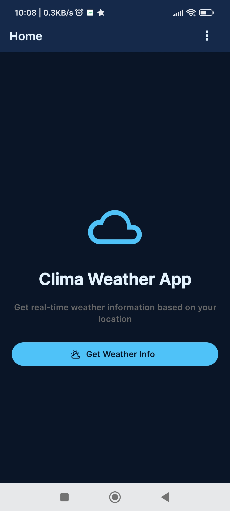
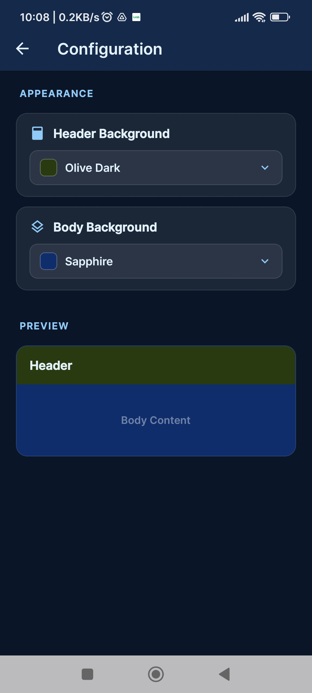
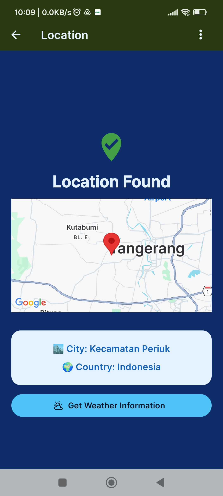
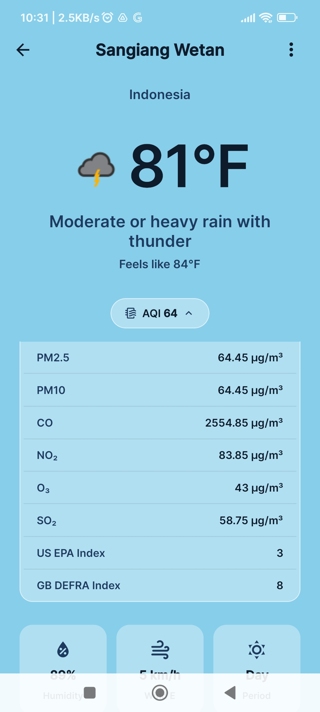
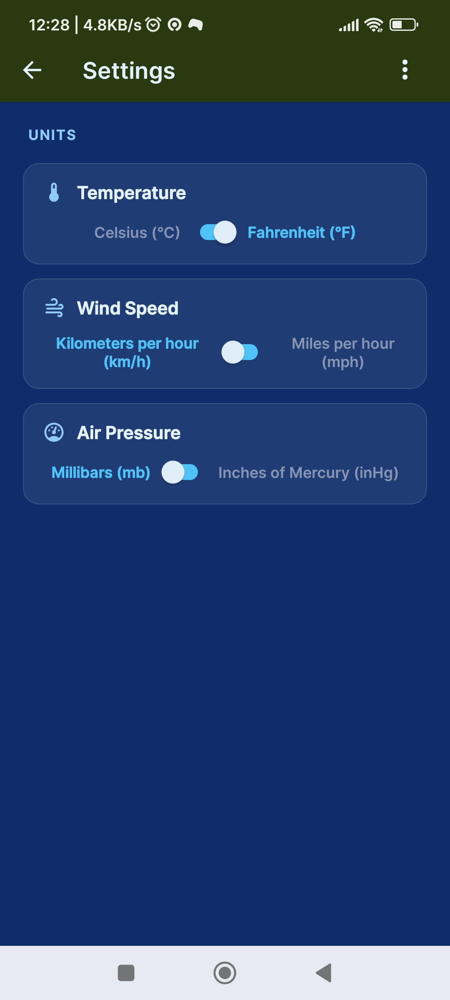

# Clima

Clima is a modern weather application built with React Native and Expo, providing real-time weather information with an attractive and user-friendly interface.

## Main Features

- **Real-Time Weather Information:** Displays temperature, weather conditions, humidity, and wind speed based on the user's location.
- **Location Search:** Users can manually search for weather in other locations.
- **Automatic Location Detection:** Supports automatic location detection using GPS.
- **Dynamic Display:** Responsive UI with engaging animations and weather icons.
- **Dark & Light Theme:** Supports dark and light mode according to user preferences.
- **Settings & Personalization:** Users can set temperature units, language, and other preferences.

## Technology

- **React Native & Expo** for cross-platform development (Android & iOS)
- **TypeScript** for safer and more structured code
- **Context API** for global state management
- **Weather API** to fetch the latest weather data

## Purpose

Clima is designed to provide an informative, fast, and enjoyable weather monitoring experience for users anywhere and anytime.

## Screenshots

.jpg)

---

Please proceed to the technical documentation or start the installation to try the Clima app.
